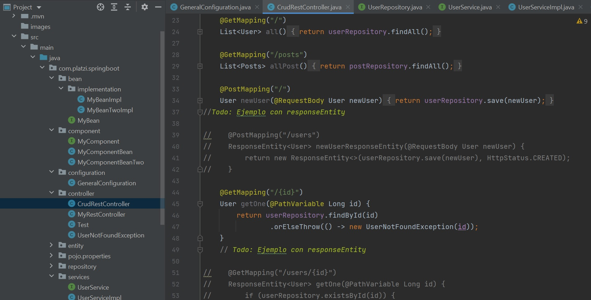

# Spring Boot Course
## Table of contents
* [Introduction](#introduction) 
* [Technologies](#technologies)
* [Commands](#commands)
* [Syntax](#syntax)
* [Illustrations](#illustrations)

**********************************************
## Introduction
Spring Boot makes it easy to create stand-alone, production-grade Spring based applications that you can "just run".

###### Features
* Create stand-alone Spring applications
* Embed Tomcat, Jetty or Undertow directly (no need to deploy WAR files)
* Provide opinionated 'starter' dependencies to simplify your build configuration
* Automatically configure Spring and 3rd party libraries whenever possible
* Provide production-ready features such as metrics, health checks, and externalized configuration
* Absolutely no code generation and no requirement for XML configuration

**********************************************

## Technologies
* Spring Boot
* Java 11
* IntelliJ IDEA 2021
* Postman 

**********************************************

## Commands
##### Spring Boot Annotations
| Annotation | Description                    |
| ------------- | ------------------------------ |
| `@Component:`      | It is used to mark a Java class as a bean.       |
| `@Controller:`   | It marks a class as a web request handler.    | 
| `@Autowired:`   | It is used to autowire spring bean on setter methods, instance variable, and constructor.     | 
| `@Configuration:`   | A source of bean definitions.     | 
| `@Bean:`   | It is an alternative of XML <bean> tag. It tells the method to produce a bean to be managed by Spring Container.     | 
| `@Service:`   | It tells the Spring that class contains the business logic.     | 
| `@Repository:`   | The repository is a DAOs (Data Access Object) that access the database directly.     | 


**********************************************
## Syntax

##### Datasource Class Configuration 
###### (GeneralConfiguration.java)
```
 @Bean
    public DataSource dataSource(){
        DataSourceBuilder dataSourceBuilder = DataSourceBuilder.create();
        dataSourceBuilder.driverClassName("org.h2.Driver");
        dataSourceBuilder.url("jdbc:h2:mem:test");
        dataSourceBuilder.username("SA");
        dataSourceBuilder.password("");
        return dataSourceBuilder.build();
    }

```

**********************************************

## Illustrations

###### CRUD Rest Code

**************************************
###### RestController


